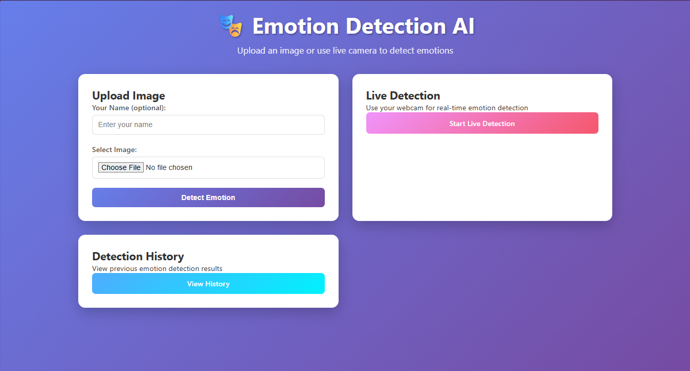

# Emotion Detection Web App 🎭

A sophisticated web application that detects human emotions from images and live camera feeds using Artificial Intelligence. Built with Flask, TensorFlow/Keras, and OpenCV.


## 📋 Table of Contents

- [Features](#features)
- [Demo](#demo)
- [Installation](#installation)
- [Usage](#usage)
- [Project Structure](#project-structure)
- [Model Architecture](#model-architecture)
- [API Endpoints](#api-endpoints)
- [Database Schema](#database-schema)
- [Hosting](#hosting)
- [Contributing](#contributing)
- [License](#license)

## ✨ Features

- **📸 Image Upload**: Upload images for emotion detection
- **🎥 Live Detection**: Real-time emotion detection using webcam
- **🤖 Pre-trained Model**: Uses advanced CNN architecture for accurate predictions
- **💾 History Tracking**: Stores all detection results in database
- **🎨 Clean UI**: Modern, responsive design with gradient backgrounds
- **📊 Confidence Scores**: Displays prediction confidence percentages
- **👤 User Management**: Optional name tracking for personalized experience

## 🚀 Demo

[Live Demo Available Here](https://amiolemen-23cd034303-emotion-app.onrender.app)



## 🛠 Installation

### Prerequisites

- Python 3.8 or higher
- pip (Python package manager)
- Webcam (for live detection feature)

### Local Setup

1. **Clone the repository**

   ```bash
   git clone https://github.com/BestOlumese/Amiolemen_23CD034303_Emotion_App.git
   cd Amiolemen_23CD034303_EMOTION_WEB_APP
   python -m venv venv
   source venv/bin/activate  # On Windows: venv\Scripts\activate
   pip install -r requirements.txt
   python app.py
   ```

2. **Project Structure**
   STUDENTS-SURNAME_MAT.NO_EMOTION_DETECTION_WEB_APP/
   │
   ├── app.py # Main Flask application
   ├── model.py # Emotion detection model class
   ├── trained_model.h5 # Pre-trained model file
   ├── emotion_detection.db # SQLite database
   ├── requirements.txt # Python dependencies
   ├── link_to_my_web_app.txt # Hosting platform information
   │
   ├── templates/ # HTML templates
   │ ├── index.html # Main application page
   │ ├── live_feed.html # Live camera detection page
   │ └── history.html # Detection history page
   │
   └── static/ # Static assets
      ├── style.css # CSS stylesheets
      ├── script.js # JavaScript functionality
      └── uploads/ # User-uploaded images storage
